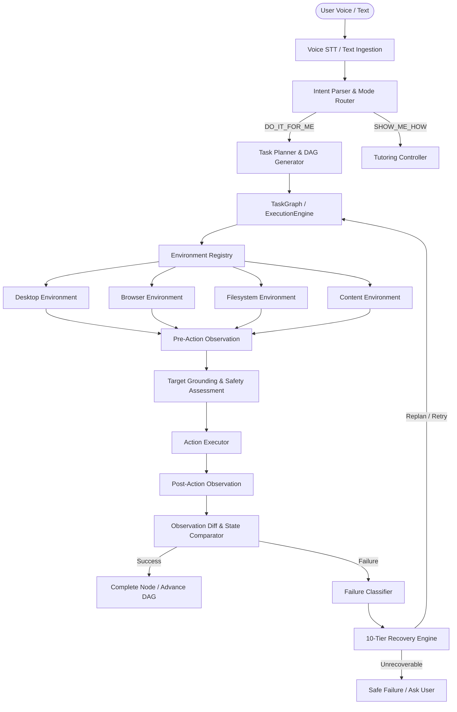
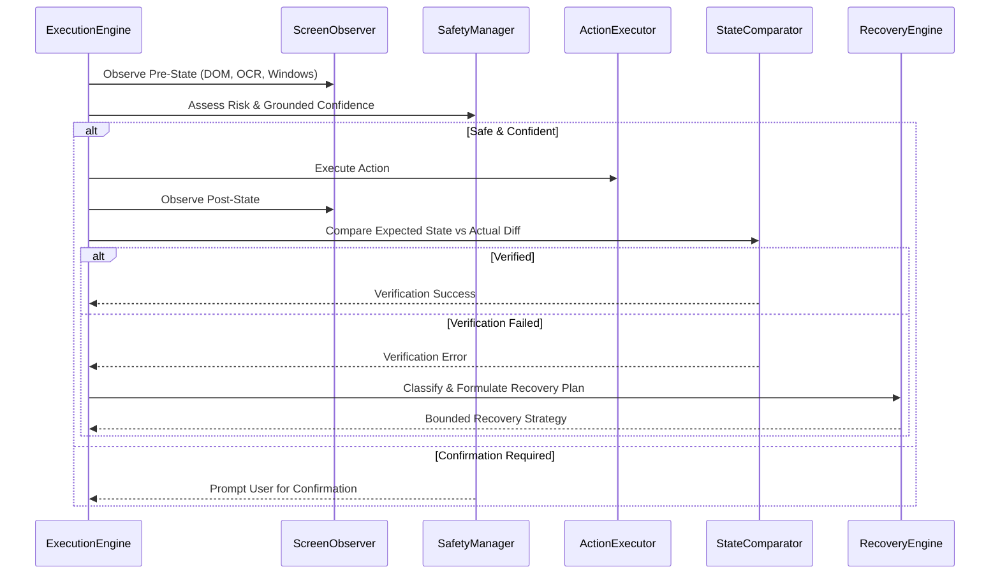
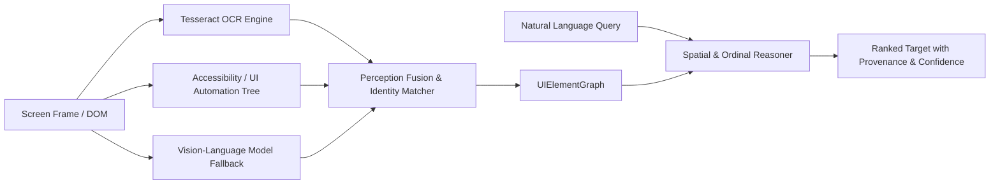

# AURA System Architecture Specification

## 1. High-Level System Architecture



---

## 2. Agent Execution Loop

The execution engine coordinates an observe-act-verify-recover cycle:



---

## 3. Computer Perception & Target Grounding Pipeline



---

## 4. Content Intelligence Architecture

```mermaid
flowchart TD
    DocSource[Source File / Webpage] --> Manager[ContentManager]
    
    Manager --> PDF[PDF Adapter (pypdf + OCR)]
    Manager --> DOCX[DOCX Adapter (python-docx)]
    Manager --> XLSX[XLSX Adapter (openpyxl)]
    Manager --> PPTX[PPTX Adapter (python-pptx)]
    Manager --> Web[Web Adapter (beautifulsoup4)]
    
    PDF & DOCX & XLSX & PPTX & Web --> UnifiedDoc[Unified ContentDocument Model]
    
    UnifiedDoc --> Search[Coordinate Search & Provenance Index]
    UnifiedDoc --> Summarizer[Extractive Summarizer]
    UnifiedDoc --> QA[Grounded Q&A Engine]
    
    Summarizer --> Export[Multi-Format Exporter (DOCX, XLSX, PPTX)]
```

---

## 5. 10-Tier Deterministic Recovery Hierarchy

1. **`REOBSERVE`**: Recapture immediate screen state after modal dismiss or transient paint latency.
2. **`REGROUND`**: Recompute element spatial bounding boxes and visual hashes.
3. **`FOCUS_APPLICATION`**: Force window to foreground via Win32 API.
4. **`RETRY`**: Re-attempt action with minor spatial jitter or timing delay.
5. **`ALTERNATE_STRATEGY`**: Switch execution mechanism (e.g. Accessibility click $\rightarrow$ Keyboard Hotkey).
6. **`SCROLL_SEARCH`**: Perform directional scrolling to bring off-screen elements into view.
7. **`LOCAL_REPLAN`**: Replace failed step with equivalent multi-action sub-graph.
8. **`GLOBAL_REPLAN`**: Restructure remaining task graph dependencies.
9. **`ASK_USER`**: Prompt user for clarifying input when ambiguity is unresolved.
10. **`FAIL_SAFELY`**: Abort cleanly, preserve task traces, and restore desktop state.
